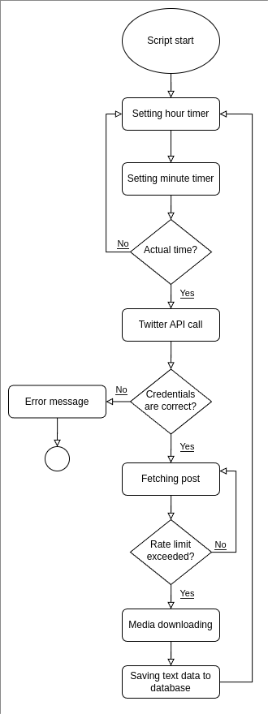

# Unifour

## Twitter API Integration

The following diagram illustrates the workflow of our Twitter API integration:

<p align="center">!</p>

This process handles the scheduling, authentication, data fetching, and storage of tweets from the Twitter API.

## Tech Stack

### Frontend
- **React** 19.0.0 - A free and open-source front-end JavaScript library that aims to make building user interfaces based on components more "seamless".
- **Material UI** 6.4.6 - Component library that implements Google's Material Design. Used for adaptive interface.
- **Axios** 1.8.1 - Promise based HTTP client for the browser and node.js. Used with Twitter API.
- **Vite** 6.0.11 - Build tool that aims to provide a faster and leaner development experience for modern web projects.
- **Font:** Nunito

### React + Vite
This template provides a minimal setup to get React working in Vite with HMR and some ESLint rules.
Currently, two official plugins are available:
- [@vitejs/plugin-react](https://github.com/vitejs/vite-plugin-react/blob/main/packages/plugin-react/README.md) uses [Babel](https://babeljs.io/) for Fast Refresh
- [@vitejs/plugin-react-swc](https://github.com/vitejs/vite-plugin-react-swc) uses [SWC](https://swc.rs/) for Fast Refresh

### Backend
- **Node.js** 21.6.2 - A free, open-source, cross-platform JavaScript runtime environment that lets developers create servers, web apps, command line tools and scripts.
- **Express** 4.21.2 - Backend web application framework for building RESTful APIs with Node.js.
- **Cors** 2.8.5 - Cross-Origin Resource Sharing (CORS) is an HTTP-header based mechanism.
- **Dotenv** 16.4.7 - We use file .env for DB and Twitter API configurations.
- **MySQL2** 3.12.0 - DBMS that available on host. Also you can use your own solution.

### Package Management
- **NPM** 10.4.0 - The standard package manager for Node.js

### Features
- We use cookies for storing your wallet address.

## Python Chatbot Testing Environment
*Not included in repository*

- **Python** 3.10.2 (It's necessary to use this version or lower in terms of compatibility)
- **PySide6** - Used for convenience, for user interface
- **TensorFlow** 2.8.4 - A software library for machine learning and artificial intelligence.
- **tflearn** 0.5.0 - A modular and transparent deep learning library built on top of Tensorflow.
- **nltk** - A leading platform for building Python programs to work with human language data.
- **numpy** - A library for adding support for large, multi-dimensional arrays and matrices, and high-level mathematical functions.
- **pickle** - This module implements binary protocols for serializing and de-serializing a Python object structure.

## Learning Process
1. HTML Parser for dataset
2. JSON Formatting
3. Learn and train set handling
4. Machine learning
5. Testing
6. Deploying

## Development Environment
- **Kate** Version 24.12.1
- **Visual Studio Code** Version 1.94.2

### VSC Extensions
- **ESLint** - A tool for identifying and reporting on patterns found in ECMAScript/JavaScript code.
- **Prettier** - An opinionated code formatter.

## Installation and Setup

```bash
# 1. Create folder Unifour
mkdir Unifour

# 2. Extract GitHub project to folder Unifour

# 3. Go to webpage directory with cd command
cd ./Unifour

# 4. Install dependencies
npm install

# 5. Run development server
npm run dev

# 6. Go to backend directory
cd ./backend

# 7. Install backend dependencies
npm install

# 8. Start the backend server
npm run start
```

## Contributing
To contribute to this project:
1. Fork the repository
2. Create your feature branch (`git checkout -b feature/amazing-feature`)
3. Commit your changes (`git commit -m 'Add some amazing feature'`)
4. Push to the branch (`git push origin feature/amazing-feature`)
5. Open a Pull Request

## License
GPL-3.0 license

## Contact
1. Webpage https://unifour.io/
2. Telegram https://t.me/unifourchanel
3. X https://x.com/unifour_SOL
